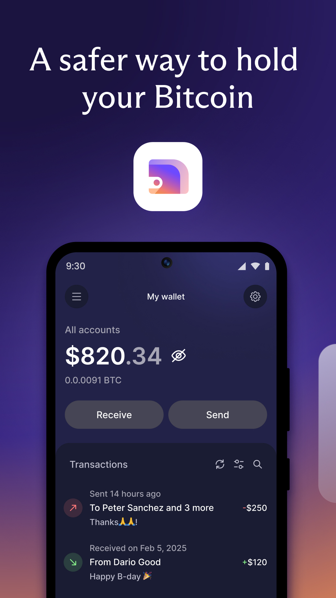
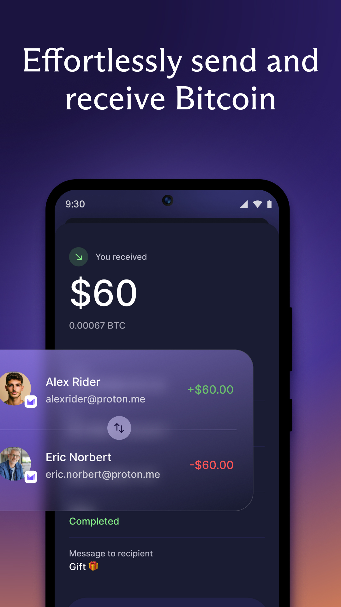
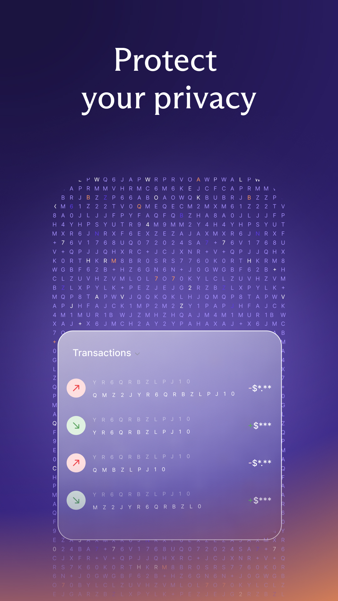
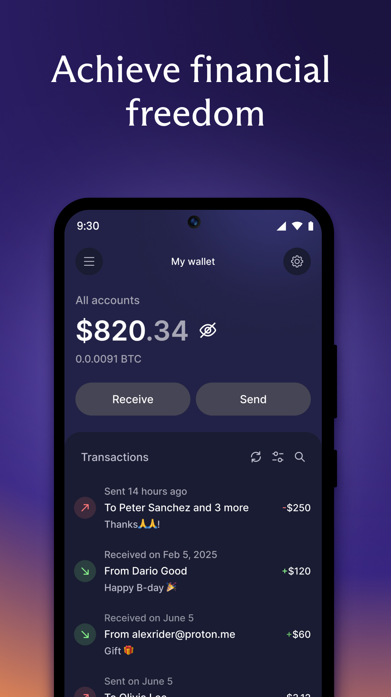

# ProtonWallet for mobile
Copyright (c) 2025 Proton Financial AG

## Download

    
    
    
    

    
    

You can also download the app (APK) directly <a href="https://proton.me/download/WalletAndroid/ProtonWallet-Android.apk" target="_blank">here</a>.

You can use the following SHA256 fingerprint of the signing certificate to verify the downloaded APK:
A4:6A:8B:E5:F5:AB:B5:CA:31:4B:A0:16:A6:65:8A:D0:8D:25:23:E8:09:41:9C:C6:09:94:85:F9:1B:9D:D4:A8

## Submodules
ProtonWallet mobile build required following submodule:
- <a href="https://github.com/ProtonWallet/andromeda" target="_blank">andromeda</a>

## Build instructions
- <a href="build_instructions/android/README.md" >Android</a>
- iOS (WIP)

## Signing
All `release` builds done on CI are automatically signed with ProtonWallet's keystore, and depending on the distribution method, they are categorized as follows:
- Google Play Store (App Bundle)
- Official APK available via our download link

## Versioning
Version matches format: `[major][minor][patch]`

## Observability
Crashes and errors that happen in `release` (non debuggable) builds are reported to Sentry in an anonymized form.

## Help us to translate the project
You can learn more about it on [our blog post](https://proton.me/blog/translation-community).

## License
The code and data files in this distribution are licensed under the terms of the GNU General Public License as published by the Free Software Foundation, either version 3 of the License, or (at your option) any later version. See <https://www.gnu.org/licenses/> for a copy of this license.

See [LICENSE](LICENSE) file
